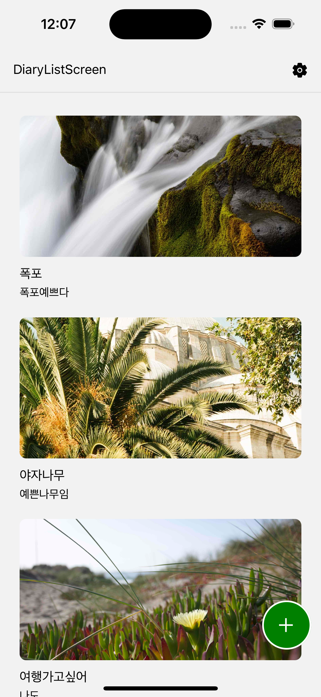
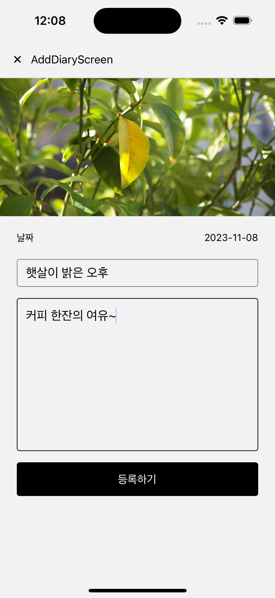

## ReactNative - 나만의 일기 앱 만들기

사진을 업로드하고 글을 작성할 수 있는 일기 앱

### 작업내용

- [x] UI 화면 구성
- [x] Firebase 구글 로그인
- [x] Firebase DB에 로그인 유무 저장
- [x] 프로필 이미지 변경시 선택한 이미지 DB에 저장하고 가져오기
- [x] 캘린더 이용하여 날짜 읽어오는 로직 추가
- [x] Firebase DB에 게시물 데이터 저장
- [x] 비밀번호 지정, 리셋 기능 추가
- [x] 사용자 편의성 알림 추가

### 기술스택

React-Native(expo), JavaScript,  
@react-native-firebase/database, @react-native-firebase/storage,  
@react-native-firebase/auth, @react-native-google-signin/google-signin,  
expo-image-picker,
react-native-modal-datetime-picker
